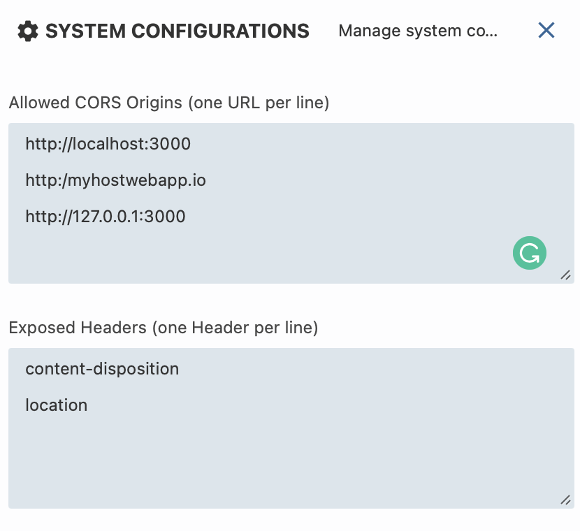

# WynReportsEmbeddedSample_Angular

This sample demonstrates the use of GrapeCity Wyn Report Designer & Viewer connected to the Wyn portal.

## System requirements

This sample requires:
 * [Node.js](https://nodejs.org/en/download/) 10.14.0 or newer
 * [Wyn Enterprise](https://wyn.grapecity.com/demos/request/trial) 5.0.00236.0 or newer

### Wyn Enterprise System Configurations for API usage
1. In the Administrator Portal after installing Wyn Enterprise, open the System Configuration Page. 
2. Add http://localhost:4200 (or the host application URL) in the "Allowed CORS Origins" section. 
3. Add 'content-disposition' and 'location' in the "Exposed Headers" section. 

After configuration, the System configuration page should look like the image below: 

## Build and run the sample

2. Enter `npm install`
2. Enter `npm run build`
5. Enter `ng run start`
6. Open http://localhost:3000 in browser

### Documentation

- [Developer Documentation](https://learn.wynenterprise.com/docs/dev-docs/)
- [Embedding Wyn Report Viewer and Designer Using Div Tags](https://learn.wynenterprise.com/docs/dev-docs/Embedding-Wyn/Embedding-Designer-Viewer-Using-Div)
